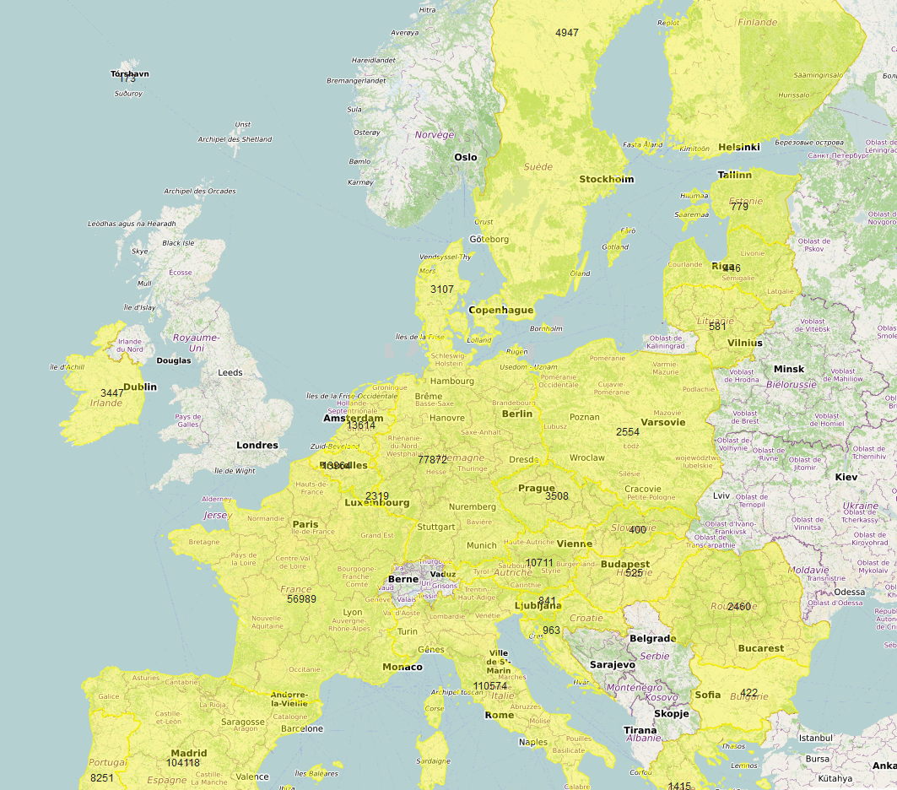

# Présentation
- Langage utilisé : R
- Objectif : faire une carte pour visualiser des données, car je n'en avais jamais fait.

# Supports
- ThinkR https://thinkr.fr/sil-te-plait-dessine-moi-carte-r/
- Claire Della Vdeova https://statistique-et-logiciel-r.com/premiers-pas-en-cartographie-avec-r/

Ces deux supports sont assez didactiques et permettent de comprendre la démarche pour réaliser une carte et afficher des données.

# Cartes
Les fonds de cartes utilisés sont ceux d'OpenStreeetMap. Les fonds disponibles pour leaflet sont présentés ici : http://leaflet-extras.github.io/leaflet-providers/preview/

Les contours de pays ont été téléchargés sur le site d'Eurostat : https://ec.europa.eu/eurostat/web/gisco/geodata/reference-data/administrative-units-statistical-units/countries

Il a ici été téléchargé et placé dans le répertoire shape (countries 2016, échelle 1:10million).

# Difficultés rencontrées
- paramétrage du proxy Insee pour récupérer les données (tout le monde n'est pas concerné ; tout dépend de votre poste de travail)
- comprendre le principe du shapefile pour les contours et trouver les bons :-)

# But du programme :
- récupérer les données de cas confirmés dans le monde (données de Johns Hopkins)
- filtrer les données pour ne garder que les noms des pays, les latitude et longitude, le nombre de cas au 1er avril
- filtrer les données pour ne garder que l'Union Européenne
- récupérer les contours des pays et ne garder que ceux e l'Union Européenne
- créer une carte en :
    - limitant son affichage sur une zone
    - ajouter le fonds de carte
    - ajouter les contours des pays de l'Union et les mettre en évidence
    - afficher le nombre de cas sur chacun des pays

# Résultat

